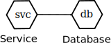
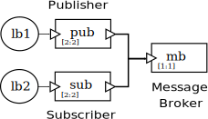

## About Design Patterns
Best practices recommend to apply popular design patterns as building blocks for microservices-based architectures.

This section provides a foundational toolbox for modeling many of these patterns using our modeling language.

For each microservice design pattern, a brief explanation along with a descriptive diagram are presented. Then a tentative model is proposed. The model is presented both with an informal box-and-line diagram and with a ready-to-deploy specification. The specification describes an ad hoc application which demonstrates the pattern functionality.

To deploy each model, appropriate instructions using [the Deployer tool](../../README.md#the-deployer) are provided. All the examples have been tested in a local environment. The published entry points are available in ports beginning from 30000.

## Catalog of Patterns

- [Gateway](#gateway)
- [Load Balancer](#load-balancer)
- [Circuit Breaker](#circuit-breaker)
- [Client-side service discovery](#client-side-service-discovery)
- [Server-side service discovery](#server-side-service-discovery)
- [Database per service](#database-per-service)
- [Shared database](#shared-database)
- [Event-driven architecture](#event-driven-architecture)

## Gateway
It provides a single entry point for accessing multiple microservices by publishing a unified API.

### Gateway > Diagram

    

### Gateway > Model

    

The specification is available in [gateway.yaml](./gateway.yaml).

### Gateway > Deployment

To deploy this model, run:

```bash
# Deploy to Kubernetes
$ npm run deploy -- samples/patterns/gateway.yaml
# Deploy to Docker Compose
$ npm run deploy -- samples/patterns/gateway.yaml -t compose
```

Then, open a browser a point to [http://127.0.0.1:30000/](http://127.0.0.1:30000/).

You will be able to access Service 1 through URL [http://127.0.0.1:30000/service1](http://127.0.0.1:30000/service1).

You will be able to access Service 2 through URL [http://127.0.0.1:30000/service2](http://127.0.0.1:30000/service2).

## Load Balancer
It distributes the load among different instances.

### Load Balancer > Diagram

    

### Load Balancer > Model


The specification is available in [load-balancer.yaml](./load-balancer.yaml)

### Load Balancer > Deployment

To deploy this model, run:

```bash
# Deploy to Kubernetes
$ npm run deploy -- samples/patterns/load-balancer.yaml
# Deploy to Docker Compose
$ npm run deploy -- samples/patterns/load-balancer.yaml -t compose
```

Then, open a browser a point to [http://127.0.0.1:30000/](http://127.0.0.1:30000/). 

It will automatically redirect requests.

## Circuit Breaker
It protects a target microservice, monitoring its health status. When the microservice is healthy the circuit breaker is closed and forwards all requests. When the microservice failure rate is high enough the circuit breaker is open and prevents forwarding requests. When the microservice begins recovering the circuit breaker is half-open until it either becomes fully closed or jumps again to the open state.

### Circuit Breaker > Diagram

    

### Circuit Breaker > Model


The specification is available in [circuit-breaker.yaml](./circuit-breaker.yaml).

### Circuit Breaker > Deployment

To deploy this model, run:

```bash
# Deploy to Kubernetes
$ npm run deploy -- samples/patterns/circuit-breaker.yaml
# Deploy to Docker Compose
$ npm run deploy -- samples/patterns/circuit-breaker.yaml -t compose
```

Then, open a browser a point to [http://127.0.0.1:30000/](http://127.0.0.1:30000/). 

You will access the protected service. Then you will be able to simulate the service failure, and you will experience the circuit breaker opening, and closing again after some time.

## Client-side service discovery
It solves the problem of discovering the location of another microservice by letting the client obtain such location from a Service Registry.

### Client-side service discovery > Diagram

    

### Client-side service discovery > Model

    

The specification is available in [client-side-service-discovery.yaml](./client-side-service-discovery.yaml).

### Client-side service discovery > Deployment

To deploy this model, run:

```bash
# Deploy to Kubernetes
$ npm run deploy -- samples/patterns/client-side-service-discovery.yaml
# Deploy to Docker Compose
$ npm run deploy -- samples/patterns/client-side-service-discovery.yaml -t compose
```

Then, open a browser a point to [http://127.0.0.1:30000/](http://127.0.0.1:30000/).

You will see how the client discovers all connected peers, and you will be able to access them.

## Server-side service discovery
The client does not directly access the target microservice. Instead it accesses an intermediary with a fixed address. This intermediary obtains the location of the target microservice and redirects requests.

### Server-side service discovery > Diagram

    

### Server-side service discovery > Model

  

The specification is available in [server-side-service-discovery.yaml](./server-side-service-discovery.yaml).

### Server-side service discovery > Deployment

To deploy this model, run:

```bash
# Deploy to Kubernetes
$ npm run deploy -- samples/patterns/server-side-service-discovery.yaml
# Deploy to Docker Compose
$ npm run deploy -- samples/patterns/server-side-service-discovery.yaml -t compose
```

Then, open a browser a point to [http://127.0.0.1:30000/](http://127.0.0.1:30000/).

You will see how the client discovers automatically the load balancer, and you will be able to access the connected peers.

## Database per service
Each microservice has access to a privative data store. Other services are unable to access it.

### Database per service > Diagram

    

### Database per service > Model

    

The specification is available in [database-per-service.yaml](./database-per-service.yaml).

### Database per service > Deployment

To deploy this model, run:

```bash
# Deploy to Kubernetes
$ npm run deploy -- samples/patterns/database-per-service.yaml
# Deploy to Docker Compose
$ npm run deploy -- samples/patterns/database-per-service.yaml -t compose
```

Then, open a browser a point to [http://127.0.0.1:30000/](http://127.0.0.1:30000/).

You will be able to store information in the database and it will be automatically refreshed.

## Shared database
Multiple microservices access the same data store.

### Shared database > Diagram

    

### Shared database > Model

   

The specification is available in [shared-database.yaml](./shared-database.yaml).

### Shared database > Deployment

To deploy this model, run:

```bash
# Deploy to Kubernetes
$ npm run deploy -- samples/patterns/shared-database.yaml
# Deploy to Docker Compose
$ npm run deploy -- samples/patterns/shared-database.yaml -t compose
```

Then, open a browser a point to [http://127.0.0.1:30000/](http://127.0.0.1:30000/).

You will be able to store information in the database and it will be automatically refreshed.

## Event-driven architecture
With this pattern some microservices publish events. Other microservices subscribe to events. It implements a loosely coupled architecture. Neither publishers nor subscribers need to know about each other.

### Event-driven architecture > Diagram

    

### Event-driven architecture > Model

    

The specification is available in [event-driven-architecture.yaml](./event-driven-architecture.yaml).

### Event-driven architecture > Deployment

To deploy this model, run:

```bash
# Deploy to Kubernetes
$ npm run deploy -- samples/patterns/event-driven-architecture.yaml
# Deploy to Docker Compose
$ npm run deploy -- samples/patterns/event-driven-architecture.yaml -t compose
```

Then, open a browser a point to [http://127.0.0.1:30000/](http://127.0.0.1:30000/), to see the publisher.

Then, open another browser a point to [http://127.0.0.1:30001/](http://127.0.0.1:30001/), to see the subscriber.

You will be able to publish new messages, and receive them.