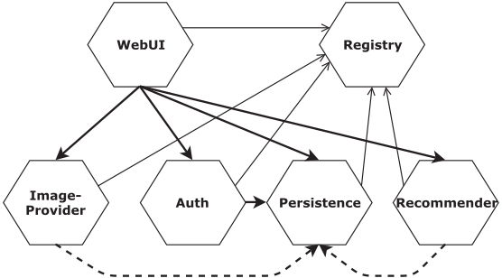

## About TeaStore
In this section we use our language for modeling a microservice reference application called TeaStore. 

## Table of contents
- [TeaStore](#teastore)
- [The original model](#the-original-model)
- [The refined model](#the-refined-model)

## TeaStore

TeaStore is an amazing application first published in:

 > Jóakim von Kistowski and Simon Eismann and Norbert Schmitt and André Bauer and Johannes Grohmann and Samuel Kounev. TeaStore: A Micro-Service Reference Application for Benchmarking, Modeling and Resource Management Research. Proceedings of the 26th IEEE International Symposium on the Modelling, Analysis, and Simulation of Computer and Telecommunication Systems. 2018.

There is an implementation of this application available in the GitHub repository:

> [https://github.com/DescartesResearch/TeaStore](https://github.com/DescartesResearch/TeaStore)

The general architecture of this application can be observed in the following diagram:

  

## The Original Model

The implementation provided in [GitHub](https://github.com/DescartesResearch/TeaStore) follows the architecture previously shown. This implementation can be easily modeled with our modeling language. The specification is available in [teastore-original.yaml](./teastore-original.yaml). 

To deploy the model with [the Deployer tool](../../README.md#the-deployer) follow the next instructions:

```bash
# Deploy to Kubernetes
$ npm run deploy -- samples/teastore/teastore-original.yaml
# Deploy to Docker Compose
$ npm run deploy -- samples/teastore/teastore-original.yaml -t compose
```

After a while (the database must be populated) the application will be available in [http://127.0.0.1:30000/](http://127.0.0.1:30000/).

## The Refined Model

Here we provide a second version of the model. In our opinion, this model describes more accurately the application architecture. On the one hand it defines the real microservice dependencies, which are connected through load balancer connectors. On the other hand it removes infrastructure-related details, like the registry pattern for solving the service discovery problem. This specification is available in [teastore.yaml](./teastore.yaml).

Deploying this model with [the Deployer tool](../../README.md#the-deployer) is a little bit more involved since some minimal code in the original [TeaStore GitHub](https://github.com/DescartesResearch/TeaStore) repository must be changed. In particular, the code devoted to solve service references using the registry pattern. This just involves modifying three files: [baseContext.xml](./src/utilities/tools.descartes.teastore.dockerbase/baseContext.xml), [start.sh](./src/utilities/tools.descartes.teastore.dockerbase/start.sh) and [RegistryClient.java](./src/utilities/tools.descartes.teastore.registryclient/src/main/java/tools/descartes/teastore/registryclient/RegistryClient.java). This means the container images must be rebuilt with the new code, and registered within a private registry. After that, the model can be regularly deployed. 

To simplify the process we provide the script [build.sh](./build.sh), which automates the following steps:
1. Clones the [original repository](https://github.com/DescartesResearch/TeaStore)
2. Copies the three modified files into the original repository
3. Builds the code (JDK and Maven are required)
4. Builds the Docker images of the different microservices
5. Pushes the local images to the private Docker registry

Therefore, to deploy the model follow the next instructions:

1. Start local private Docker registry

    ```bash
    $ docker run -d -p 5000:5000 --name registry registry:2
    ```

2. Build the new images and push them to the private Docker registry

    ```bash
    $ cd samples/teastore
    $ ./build.sh
    ```

3. Deploy the model

    ```bash
    $ cd ../..
    # Deploy to Kubernetes
    $ npm run deploy -- samples/teastore/teastore.yaml
    # Deploy to Docker Compose
    $ npm run deploy -- samples/teastore/teastore.yaml -t compose
    ```

After a while (the database must be populated) the application will be available in [http://127.0.0.1:30000/](http://127.0.0.1:30000/).